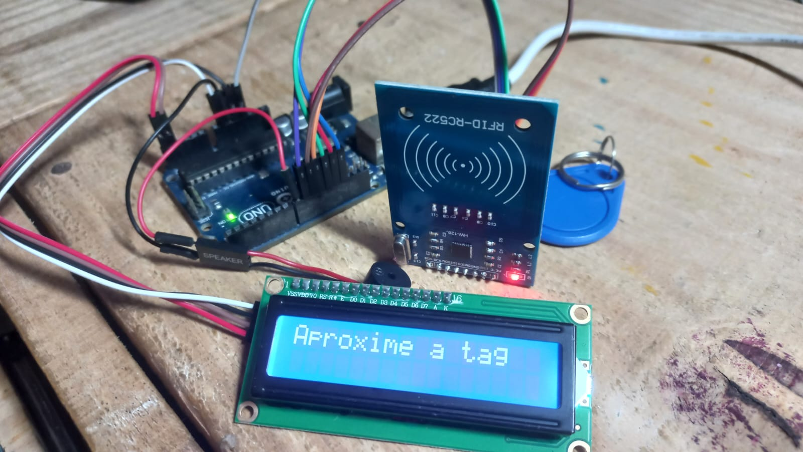

# 🏋️ Sistema de Academia RFID com Google Sheets

Sistema completo de controle de acesso usando Arduino, RFID e Planilhas Google para registro de entrada e saída, esse sistema foi feito para 
uma pequena academia de bairro que precisava de um sistema assim, de controle.

## 🚀 Funcionalidades
- Cadastro de novos alunos via Web Serial API.
- Registro automático de Entrada (ON) e Saída (OFF) na planilha.
- Feedback em tempo real no Display LCD e Buzzer.
- Cálculo de estatísticas de presença.

## 📸 Imagem real do projeto
<p align="left">
  
</p>

## 🛠️ Hardware Utilizado
- Arduino Uno
- Leitor RFID RC522
- Display LCD 16x2 com I2C
- Buzzer Ativo (aqueles de pcs mesmo)
- Jumpers

## 💻 Tecnologias
- **Frontend:** HTML5, CSS3, JavaScript (Web Serial API).
- **Backend:** Google Apps Script (JavaScript).
- **Banco de Dados:** Google Sheets.
- **Firmware:** C++ (Arduino IDE).

### 🤖 Código HTML do projeto
```html
// Cole seu código HTML aqui
<!DOCTYPE html>
<html lang="pt-br">
<head>
    <meta charset="UTF-8">
    <title>Sistema Academia - Cadastro RFID</title>
    <style>
        body { font-family: 'Segoe UI', Tahoma, Geneva, Verdana, sans-serif; padding: 30px; background-color: #f4f7f6; }
        .container { max-width: 500px; background: white; padding: 20px; border-radius: 10px; box-shadow: 0 4px 6px rgba(0,0,0,0.1); margin: auto; }
        h2 { color: #333; text-align: center; }
        label { font-weight: bold; font-size: 0.9em; color: #555; }
        input { margin-bottom: 15px; padding: 12px; width: calc(100% - 26px); border: 1px solid #ddd; border-radius: 5px; display: block; font-size: 1em; }
        button { width: 100%; padding: 12px; cursor: pointer; border: none; border-radius: 5px; font-weight: bold; transition: 0.3s; }
        .btn-connect { background-color: #007bff; color: white; margin-bottom: 20px; }
        .btn-save { background-color: #28a745; color: white; font-size: 1.1em; }
        #status { text-align: center; font-size: 0.85em; margin-bottom: 20px; color: #666; }

        .modal { display: none; position: fixed; z-index: 999; left: 0; top: 0; width: 100%; height: 100%; background: rgba(0,0,0,0.5); align-items: center; justify-content: center; }
        .modal-content { background: white; padding: 40px; border-radius: 15px; text-align: center; max-width: 400px; width: 80%; animation: popup 0.3s ease-out; }
        @keyframes popup { from { transform: scale(0.7); opacity: 0; } to { transform: scale(1); opacity: 1; } }
        .icon-sucesso { color: #28a745; font-size: 50px; }
        .icon-aviso { color: #ff9800; font-size: 50px; }
    </style>
</head>
<body>

<div class="container">
    <h2>Cadastro de Aluno</h2>
    <button class="btn-connect" onclick="conectarSerial()">1. Conectar Arduino (USB)</button>
    <div id="status">Status: Desconectado</div>

    <hr>
    <label>ID da Tag:</label>
    <input id="uid" placeholder="Aproxime a tag..." readonly style="background: #f9f9f9; border-color: #007bff;">
    
    <input id="nome" placeholder="Nome Completo">
    <input id="cidade" placeholder="Cidade">
    <input id="bairro" placeholder="Bairro">
    <input id="peso" placeholder="Peso (ex: 80kg)">
    <input id="modalidade" placeholder="Modalidade">
    <input id="horario" placeholder="Horário">
    <input id="foto" placeholder="URL da foto">

    <button class="btn-save" onclick="enviar()">2. Salvar na Planilha</button>
</div>

<div id="meuModal" class="modal">
    <div class="modal-content">
        <div id="modalIcon"></div>
        <h3 id="modalTitulo"></h3>
        <p id="modalTexto"></p>
    </div>
</div>

<script>
    const urlPlanilha = "URL DO SCRIPT"; 
    let port;
    let keepReading = true;

    async function conectarSerial() {
        if (!("serial" in navigator)) return alert("Use o Chrome!");
        try {
            port = await navigator.serial.requestPort();
            await port.open({ baudRate: 9600 });
            document.getElementById('status').innerText = "Status: Conectado! Aproxime a tag.";
            document.getElementById('status').style.color = "green";
            keepReading = true;
            lerDados();
        } catch (e) { alert("Erro ao abrir porta: " + e); }
    }

    async function lerDados() {
        while (port.readable && keepReading) {
            const decoder = new TextDecoderStream();
            const readableStreamClosed = port.readable.pipeTo(decoder.writable);
            const reader = decoder.readable.getReader();
            let buffer = "";

            try {
                while (true) {
                    const { value, done } = await reader.read();
                    if (done) break;
                    buffer += value;

                    if (buffer.includes("\n") || buffer.includes("\r")) {
                        let idLido = buffer.trim();
                        if (idLido.length >= 4) {
                            document.getElementById('uid').value = idLido;
                            verificarExistencia(idLido);
                        }
                        buffer = ""; 
                    }
                }
            } catch (error) {
                console.error("Erro na leitura:", error);
            } finally {
                reader.releaseLock();
                await readableStreamClosed.catch(() => {});
            }
            await new Promise(resolve => setTimeout(resolve, 100));
        }
    }

    // --- FUNÇÃO ATUALIZADA PARA ENVIAR NOME E STATUS (ON/OFF) ---
    async function verificarExistencia(uid) {
        try {
            const res = await fetch(`${urlPlanilha}?uid=${uid}`);
            const data = await res.json();
            if (data.encontrado) {
                // Mostra popup com o status (Entrada ou Saída)
                mostrarPopup("aviso", data.nome, "Status: " + data.status);
                document.getElementById('nome').value = data.nome;

                // Envia "Nome|Status" para o Arduino (Ex: "Joao|ON")
                if (port && port.writable) {
                    const encoder = new TextEncoder();
                    const writer = port.writable.getWriter();
                    await writer.write(encoder.encode(data.nome + "|" + data.status + "\n"));
                    writer.releaseLock();
                }
                
                setTimeout(() => { 
                    fecharPopup(); 
                    limparTudo(); 
                }, 4000);
            }
        } catch (e) { console.log("Erro na verificação."); }
    }

    function enviar() {
        let uid = document.getElementById('uid').value;
        let nome = document.getElementById('nome').value;
        if (!uid || !nome) return alert("Falta o ID ou o Nome!");

        let dados = {
            uid: uid, nome: nome,
            cidade: document.getElementById('cidade').value,
            bairro: document.getElementById('bairro').value,
            peso: document.getElementById('peso').value,
            modalidade: document.getElementById('modalidade').value,
            horario: document.getElementById('horario').value,
            foto: document.getElementById('foto').value
        };

        fetch(urlPlanilha, { method: "POST", mode: "no-cors", body: JSON.stringify(dados) })
        .then(async () => {
            mostrarPopup("sucesso", "Sucesso!", "Cadastrado na planilha!");

            if (port && port.writable) {
                const encoder = new TextEncoder();
                const writer = port.writable.getWriter();
                await writer.write(encoder.encode("CADASTRO OK\n"));
                writer.releaseLock();
            }

            limparTudo();
            setTimeout(fecharPopup, 3000);
        });
    }

    function mostrarPopup(tipo, tit, txt) {
        const icon = document.getElementById('modalIcon');
        icon.innerHTML = tipo === "sucesso" ? "✅" : "⚠️";
        icon.className = tipo === "sucesso" ? "icon-sucesso" : "icon-aviso";
        document.getElementById('modalTitulo').innerText = tit;
        document.getElementById('modalTexto').innerText = txt;
        document.getElementById('meuModal').style.display = "flex";
    }

    function fecharPopup() { document.getElementById('meuModal').style.display = "none"; }
    
    function limparTudo() {
        document.querySelectorAll('input').forEach(i => i.value = "");
    }
</script>
</body>
</html>
